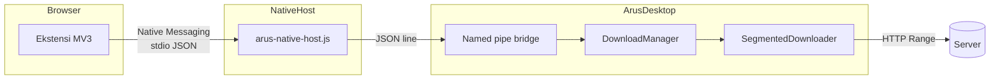

# Arus

**Arus** adalah download manager desktop untuk Windows, macOS, dan Linux — dibangun dengan **Electron + React + TypeScript**. Aplikasi ini menangani unduhan HTTP/HTTPS dengan **koneksi paralel (segmented download)**, antrean, jeda/lanjut, dan integrasi browser lewat **Native Messaging** (cara standar browser berkomunikasi dengan aplikasi desktop, seperti IDM atau Free Download Manager).

Antarmuka menggunakan desain gelap datar (flat dark) dengan aksen amber dan teal.

---

## Daftar isi

- [Fitur utama](#fitur-utama)
- [Arsitektur](#arsitektur)
- [Tech stack](#tech-stack)
- [Struktur proyek](#struktur-proyek)
- [Persyaratan](#persyaratan)
- [Instalasi & pengembangan](#instalasi--pengembangan)
- [Build aplikasi desktop](#build-aplikasi-desktop)
- [Build & pasang ekstensi browser](#build--pasang-ekstensi-browser)
- [Integrasi browser (Native Messaging)](#integrasi-browser-native-messaging)
- [Pengaturan aplikasi](#pengaturan-aplikasi)
- [Mesin unduhan](#mesin-unduhan)
- [Troubleshooting](#troubleshooting)
- [Lisensi](#lisensi)

---

## Fitur utama

### Aplikasi desktop

| Fitur | Deskripsi |
|-------|-----------|
| **Unduhan tersegmentasi** | Satu file diunduh lewat beberapa koneksi HTTP Range paralel (4–16, default 8) |
| **Antrean & konkurensi** | Hingga 3 unduhan aktif bersamaan; sisanya mengantre |
| **Jeda / lanjut / stop** | Per file, per seleksi, atau semua sekaligus |
| **Resume** | Metadata segmen disimpan di `.part.meta.json` untuk melanjutkan setelah jeda atau restart |
| **Progress real-time** | Kecepatan agregat, ETA, progress per segmen |
| **Tampilkan di folder** | Manual per file, atau otomatis saat selesai (opsional) |
| **Filter sidebar** | Semua, mengunduh, selesai, dijeda, gagal, sampah |
| **Toolbar aksi** | Pilih semua, stop all, resume/pause/remove terpilih, hapus selesai |
| **Title bar kustom** | Window frameless dengan kontrol minimize/maximize/close |

### Ekstensi browser (Chrome & Firefox)

| Fitur | Deskripsi |
|-------|-----------|
| **Intercept otomatis** | Unduhan browser yang memenuhi syarat dialihkan ke Arus |
| **Klik kanan** | *Download with Arus* pada tautan, media, atau halaman |
| **Popup** | Status koneksi, toggle intercept, ambang ukuran minimum (MB) |
| **Cookie & header** | Cookie, Referer, dan User-Agent dikirim ke Arus untuk unduhan terautentikasi |
| **Fallback aman** | Jika Arus tidak berjalan, unduhan browser **tetap berjalan** — tidak pernah di-drop diam-diam |

---

## Arsitektur



### Alur komunikasi

1. **Ekstensi** memanggil `browser.runtime.sendNativeMessage('com.genghero.arus', payload)`.
2. **Browser** meluncurkan **native host** (`arus-native-host.cmd` / `.sh`) yang ditulis ke registry / folder NativeMessagingHosts.
3. Host membaca **pesan JSON ber-prefix panjang 4 byte** dari stdin, meneruskan ke **named pipe** Arus:
   - Windows: `\\.\pipe\com.genghero.arus.bridge`
   - Linux/macOS: `/tmp/com.genghero.arus.bridge.sock`
4. **Arus** (proses utama) mendengarkan pipe, menambahkan task ke `DownloadManager`, lalu `SegmentedDownloader` mengunduh file.

Native host berjalan sebagai proses Node ringan (`ELECTRON_RUN_AS_NODE`) — **bukan** membuka jendela Electron baru.

### ID ekstensi (stabil)

| Browser | ID |
|---------|-----|
| Chrome / Edge / Brave (unpacked) | `pnmkpgoolmmekpecphmakboegpajanmc` |
| Firefox | `arus@genghero.com` |
| Native host name | `com.genghero.arus` |

---

## Tech stack

| Lapisan | Teknologi |
|---------|-----------|
| Desktop shell | Electron 37 |
| UI | React 19, Framer Motion |
| Build desktop | electron-vite, Vite, TypeScript |
| Mesin unduhan | Node.js `http`/`https`, keep-alive agents |
| Ekstensi | Manifest V3, TypeScript, `webextension-polyfill` |
| Build ekstensi | Vite (esbuild), `web-ext` (paket Firefox) |
| Packaging desktop | electron-builder (NSIS di Windows) |

---

## Struktur proyek

```
genghero-download-manager/
├── src/
│   ├── main/                 # Proses utama Electron
│   │   ├── main.ts           # Window, IPC, lifecycle
│   │   ├── downloadManager.ts
│   │   ├── segmentedDownloader.ts
│   │   └── nativeMessaging/  # Pipe bridge + registrasi host
│   ├── preload/              # contextBridge API ke renderer
│   ├── renderer/             # React UI
│   └── shared/               # Tipe TypeScript bersama
├── extension/                # ACTIVE browser companion (MV3 + Native Messaging)
│   ├── src/
│   │   ├── background/       # Service worker / background script
│   │   ├── popup/            # UI popup ekstensi
│   │   └── shared/           # Native client, settings
│   ├── dist/chrome/          # Load unpacked Chrome/Edge/Brave dari sini
│   ├── dist/firefox/         # Load Firefox dari sini
│   └── scripts/build.mjs
├── resources/                # Ikon aplikasi
├── build/                    # Ikon untuk electron-builder
├── extension-legacy-http/    # (Legacy) HTTP bridge — jangan load unpacked
├── package.json
└── electron.vite.config.ts
```

---

## Persyaratan

- **Node.js** 20+ (disarankan LTS)
- **npm** 10+
- Untuk build installer: toolchain OS masing-masing (NSIS di Windows)
- Browser: Chrome 88+, Edge, Brave, atau Firefox 128+ (MV3)

---

## Instalasi & pengembangan

```bash
# Clone repositori
git clone <url-repo>
cd genghero-download-manager

# Dependensi aplikasi desktop
npm install

# Dependensi ekstensi (sekali)
cd extension && npm install && cd ..

# Mode pengembangan (hot reload UI)
npm run dev
```

Saat `npm run dev` berjalan:

1. Buka aplikasi Arus.
2. Di **Pengaturan → Integrasi browser**, pastikan toggle aktif (native host terdaftar otomatis).
3. Load ekstensi dari `extension/dist/chrome` (build dulu jika belum ada).

---

## Build aplikasi desktop

```bash
# Typecheck + bundle Electron (out/)
npm run build

# Build ekstensi + aplikasi + installer NSIS (release/)
npm run dist
```

Output:

| Perintah | Hasil |
|----------|-------|
| `npm run build` | `out/main`, `out/preload`, `out/renderer` |
| `npm run dist` | `release/Arus Setup x.x.x.exe` (Windows) + ekstensi di `extraResources` |

Data pengguna disimpan di folder `userData` Electron:

- `arus-downloads.json` — daftar task
- `arus-settings.json` — pengaturan
- `native-messaging/` — launcher & manifest host

---

## Build & pasang ekstensi browser

### Build

```bash
# Keduanya (Chrome + Firefox)
npm run build:extension

# Per browser
npm run build:extension:chrome
npm run build:extension:firefox

# Zip untuk distribusi / AMO
npm run package:extension
# → extension/artifacts/arus-extension-chrome.zip
# → extension/artifacts/arus-extension-firefox.zip
```

### Pasang di browser

**Chrome / Edge / Brave**

1. Buka `chrome://extensions` (atau `edge://extensions`)
2. Aktifkan **Developer mode**
3. **Load unpacked** → pilih folder `extension/dist/chrome`
4. Pastikan Arus sedang berjalan

**Firefox**

1. Buka `about:debugging#/runtime/this-firefox`
2. **Load Temporary Add-on…** → pilih `extension/dist/firefox/manifest.json`

> Add-on Firefox sementara hilang saat browser ditutup. Untuk distribusi permanen, gunakan artefak `web-ext` dan proses signing AMO.

### Verifikasi koneksi

Klik ikon ekstensi Arus di toolbar browser. Popup harus menampilkan **Connected to Arus**. Jika tidak:

- Pastikan aplikasi Arus terbuka
- Buka Arus → Pengaturan → **Pasang ulang native host**
- Reload ekstensi di `chrome://extensions`

---

## Integrasi browser (Native Messaging)

### Apa yang didaftarkan saat Arus berjalan?

| Platform | Lokasi registrasi |
|----------|-------------------|
| Windows (Chrome) | `HKCU\Software\Google\Chrome\NativeMessagingHosts\com.genghero.arus` |
| Windows (Edge) | `HKCU\Software\Microsoft\Edge\NativeMessagingHosts\...` |
| Windows (Brave) | `HKCU\Software\BraveSoftware\Brave-Browser\NativeMessagingHosts\...` |
| Windows (Firefox) | `HKCU\Software\Mozilla\NativeMessagingHosts\...` |
| macOS / Linux | `NativeMessagingHosts/` di folder profil browser masing-masing |

Manifest host menunjuk ke launcher di `%APPDATA%/Arus/native-messaging/` (atau setara di OS lain).

### Protokol pesan

**Native Messaging (extension ↔ host):** JSON dengan prefix 4-byte little-endian length.

**Pipe bridge (host ↔ Arus):** satu baris JSON per request/response.

Request unduhan:

```json
{
  "type": "download",
  "url": "https://example.com/file.zip",
  "referrer": "https://example.com/",
  "fileName": "file.zip",
  "headers": { "User-Agent": "..." },
  "cookie": "session=..."
}
```

Response sukses:

```json
{ "type": "download-result", "ok": true, "id": "<uuid>" }
```

### Logika intercept ekstensi

Unduhan browser diintercept jika:

- Toggle **Auto-intercept** aktif di popup, dan
- URL bukan `blob:` / `data:`, dan
- Bukan unduhan dari ekstensi lain, dan
- Memenuhi **salah satu**:
  - Ekstensi file ada di daftar default (`zip`, `exe`, `mp4`, …), atau
  - Ukuran file ≥ ambang minimum (MB), atau
  - Tidak ada ambang (0 MB) dan file punya nama / MIME selain `text/html`

Hanya setelah Arus **menerima** unduhan, browser membatalkan unduhan aslinya.

---

## Pengaturan aplikasi

Buka ikon ⚙ di aplikasi Arus.

| Pengaturan | Default | Keterangan |
|------------|---------|------------|
| **Koneksi paralel** | 8 | 4–16 koneksi HTTP per file |
| **Tampilkan di folder saat selesai** | Aktif | Buka Explorer/Finder dan sorot file |
| **Browser integration** | Aktif | Native host + pipe bridge |
| **Pasang ulang native host** | — | Perbaiki registrasi jika ekstensi tidak terhubung |
| **Buka folder ekstensi** | — | Membuka `extension/dist/chrome` (dev) atau salinan di `resources` (rilis) |

---

## Mesin unduhan

### Segmented download

1. **HEAD** request untuk probe `Accept-Ranges` dan ukuran file.
2. Jika server mendukung Range, file dibagi menjadi N segmen; setiap segmen diunduh paralel.
3. File sementara: `<path>.part` dengan preallocate; metadata resume: `<path>.part.meta.json`.
4. Setelah selesai, `.part` di-rename ke path final.
5. Jika Range tidak didukung, fallback ke **single-stream** dengan resume `Range: bytes=N-`.

### File sementara & resume

```
Downloads/
  video.mp4          ← file final (setelah selesai)
  video.mp4.part     ← data sedang diunduh
  video.mp4.part.meta.json  ← posisi segmen untuk resume
```

### Header dari browser

Saat unduhan datang dari ekstensi, header `Cookie`, `Referer`, dan `User-Agent` diteruskan ke `SegmentedDownloader` — berguna untuk file yang memerlukan sesi login.

### Batasan

- Hanya URL `http://` dan `https://`
- Maks. 3 unduhan aktif bersamaan (sisanya antre)
- Retry per segmen dengan backoff (default 3x)

---

## Troubleshooting

### Ekstensi: "Native host not registered"

1. Jalankan Arus.
2. Pengaturan → aktifkan **Browser integration**.
3. Klik **Pasang ulang native host**.
4. Reload ekstensi di browser.

### Ekstensi: "Arus is not running"

Aplikasi desktop harus terbuka agar named pipe bridge aktif. Native host bisa diluncurkan browser, tetapi bridge hanya hidup saat proses Arus berjalan.

### Unduhan tidak diintercept

- Cek popup ekstensi: **Auto-intercept** harus aktif.
- Cek ambang ukuran minimum — file kecil mungkin diabaikan kecuali ekstensinya ada di daftar capture.
- Unduhan `blob:` / halaman HTML biasanya tidak diintercept.

### `EPERM` / error disk di Windows

Mesin unduhan memakai penulisan posisional serial ke file handle (bukan append + ftruncate) untuk menghindari masalah permission Windows.

### Build ekstensi gagal

```bash
cd extension
npm install
npm run build
```

Pastikan `extension/dist/chrome/manifest.json` ada sebelum load unpacked.

### Legacy `extension-legacy-http/`

Folder `extension-legacy-http/` (dulu `extensions/arus/`) adalah implementasi lama berbasis **HTTP localhost bridge**. Sudah digantikan oleh `extension/` + Native Messaging. **Jangan load unpacked dari folder ini** — pakai `extension/dist/chrome` atau `extension/dist/firefox`.

---

## Skrip npm (ringkasan)

### Root

| Skrip | Fungsi |
|-------|--------|
| `npm run dev` | Development Electron + Vite HMR |
| `npm run build` | Typecheck + build `out/` |
| `npm run dist` | Build ekstensi + app + installer |
| `npm run build:extension` | Build Chrome + Firefox |
| `npm run build:extension:chrome` | Hanya `extension/dist/chrome` |
| `npm run build:extension:firefox` | Hanya `extension/dist/firefox` |
| `npm run package:extension` | Zip + `web-ext build` |
| `npm run clean` | Hapus semua hasil build (`out`, `release`, `extension/dist`, …) |
| `npm run clean:app` | Hapus build aplikasi saja (`out`, `release`) |
| `npm run clean:extension` | Hapus build ekstensi saja (`extension/dist`, `artifacts`) |

### `extension/`

| Skrip | Fungsi |
|-------|--------|
| `npm run build` | Sama seperti `build:extension` di root |
| `npm run package` | Artefak di `extension/artifacts/` |
| `npm run clean` | Hapus `extension/dist` + `artifacts` |

---

## Desain UI

Token warna (flat dark, tanpa gradien/shadow):

| Token | Hex | Penggunaan |
|-------|-----|------------|
| Background | `#12181F` | Latar aplikasi & popup ekstensi |
| Panel | `#1E2630` | Kartu, sidebar |
| Border | `#2A323D` | Garis pemisah |
| Primary (amber) | `#F0A63F` | Aksi utama, gauge |
| Secondary (teal) | `#2DD4BF` | Status terhubung, aksen |
| Success | `#6FCF8E` | Unduhan selesai |
| Error | `#E2574C` | Gagal / peringatan |
| Text | `#EDEFF2` | Teks utama |

---

## Lisensi

MIT — lihat `package.json` (author: GENGHERO).

---

## Kontribusi

Proyek ini masih versi awal (`0.1.0`). Untuk perubahan besar (misalnya dukungan protokol baru atau integrasi store), buka issue atau diskusikan arsitektur terlebih dahulu.
