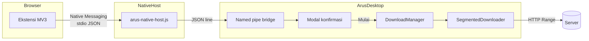

# Arus

**Arus** adalah download manager desktop bergaya IDM. Proyek ini sekarang memiliki jalur aplikasi utama **Flutter Desktop** di `lib/`, sementara implementasi Electron + React + TypeScript lama tetap disimpan selama migrasi integrasi browser berlangsung. Keduanya menangani unduhan HTTP/HTTPS dengan **koneksi paralel (segmented download)**, antrean, jeda/lanjut, dan pemulihan file `.part`.

Antarmuka menggunakan desain gelap datar (flat dark) dengan aksen amber dan teal.

---

## Daftar isi

- [Fitur utama](#fitur-utama)
- [Migrasi Flutter](#migrasi-flutter)
- [Arsitektur](#arsitektur)
- [Tech stack](#tech-stack)
- [Struktur proyek](#struktur-proyek)
- [Persyaratan](#persyaratan)
- [Instalasi & pengembangan](#instalasi--pengembangan)
- [Build aplikasi desktop](#build-aplikasi-desktop)
- [Build & pasang ekstensi browser](#build--pasang-ekstensi-browser)
- [Integrasi browser (Native Messaging)](#integrasi-browser-native-messaging)
- [Pengaturan aplikasi](#pengaturan-aplikasi)
- [Mesin unduhan](#mesin-unduhan)
- [Troubleshooting](#troubleshooting)
- [Lisensi](#lisensi)

---

## Fitur utama

### Aplikasi desktop

| Fitur | Deskripsi |
|-------|-----------|
| **Unduhan tersegmentasi** | Satu file diunduh lewat beberapa koneksi HTTP Range paralel (4–16, default 8) |
| **Antrean & konkurensi** | Hingga 3 unduhan aktif bersamaan; sisanya mengantre |
| **Jeda / lanjut / stop** | Per file, per seleksi, atau semua sekaligus |
| **Resume** | Metadata segmen disimpan di `.part.meta.json` untuk melanjutkan setelah jeda atau restart |
| **Progress real-time** | Kecepatan agregat, ETA, progress per segmen |
| **Tampilkan di folder** | Manual per file, atau otomatis saat selesai (opsional) |
| **Filter sidebar** | Semua, mengunduh, selesai, dijeda, gagal, sampah |
| **Toolbar aksi** | Pilih semua, stop all, resume/pause/remove terpilih, hapus selesai |
| **Title bar kustom** | Window frameless dengan kontrol minimize/maximize/close |

### Ekstensi browser (Chrome & Firefox)

| Fitur | Deskripsi |
|-------|-----------|
| **Intercept otomatis** | Unduhan browser yang memenuhi syarat dialihkan ke Arus dan dikonfirmasi lewat modal ringkas |
| **Klik kanan** | *Download with Arus* pada tautan, media, atau halaman |
| **Popup** | Status koneksi, toggle intercept, ambang ukuran minimum (MB) |
| **Cookie & header** | Cookie, Referer, dan User-Agent dikirim ke Arus untuk unduhan terautentikasi |
| **Fallback aman** | Jika Arus tidak berjalan, unduhan browser **tetap berjalan** — tidak pernah di-drop diam-diam |

## Migrasi Flutter

Flutter Desktop sudah menjadi jalur UI dan mesin unduhan baru. Port ini mencakup:

- dashboard gelap bergaya IDM dengan filter, statistik kecepatan, detail segmen, dan aksi bulk;
- antrean, batas unduhan bersamaan, jeda/lanjut/stop, retry koneksi, dan resume metadata;
- pembuatan folder tujuan otomatis sebelum probe, retry, dan finalisasi sehingga error `ENOENT` pada folder Downloads tidak terjadi lagi;
- settings lokal tanpa dependency eksternal, sehingga dapat berjalan di Windows, macOS, dan Linux.

Perintah pengembangan Flutter:

```powershell
flutter pub get
flutter test
flutter run -d windows
flutter build windows --release
```

Build Windows memerlukan Visual Studio dengan workload **Desktop development with C++**. Folder `extension/` dan `extension-legacy-http/` tetap dipertahankan sebagai adapter browser lama; Native Messaging belum dipanggil langsung dari Dart pada tahap port ini.

---

## Arsitektur



### Alur komunikasi

1. **Ekstensi** memanggil `browser.runtime.sendNativeMessage('com.arus.app', payload)`.
2. **Browser** meluncurkan **native host** (`arus-native-host.cmd` / `.sh`) yang ditulis ke registry / folder NativeMessagingHosts.
3. Host membaca **pesan JSON ber-prefix panjang 4 byte** dari stdin, meneruskan ke **named pipe** Arus:
   - Windows: `\\.\pipe\com.arus.app.bridge.v2`
   - Linux/macOS: `/tmp/com.arus.app.bridge.v2.sock`
4. **Arus** (proses utama di system tray) menyimpan permintaan sebagai pending dan langsung mengakuinya agar browser tidak timeout.
5. Modal konfirmasi kecil meminta nama file dan folder. Tombol **Mulai download** baru menambahkan task ke `DownloadManager`; **Batal** membuang permintaan.

Native host berjalan sebagai proses Node ringan (`ELECTRON_RUN_AS_NODE`) — **bukan** membuka jendela Electron baru.

### ID ekstensi (stabil)

| Browser | ID |
|---------|-----|
| Chrome / Edge / Brave (unpacked) | `pnmkpgoolmmekpecphmakboegpajanmc` |
| Firefox | `arus@arus.app` |
| Native host name | `com.arus.app` |

---

## Tech stack

| Lapisan | Teknologi |
|---------|-----------|
| Desktop shell utama | Flutter 3.44.8, Dart 3.12 |
| UI utama | Flutter Material 3 |
| Mesin unduhan utama | Dart `dart:io`, `HttpClient`, positional file writes |
| Jalur transisi | Electron 37, React 19, TypeScript |
| Ekstensi | Manifest V3, TypeScript, `webextension-polyfill` |
| Build desktop Flutter | CMake + Visual Studio Desktop C++ (Windows) |
| Build ekstensi | Vite (esbuild), `web-ext` (paket Firefox) |

---

## Struktur proyek

```
arus/
├── lib/                    # Aplikasi Flutter utama
│   ├── main.dart           # Dashboard dan settings Material 3
│   └── src/
│       ├── models/         # Task, segment, settings, progress
│       ├── services/       # Queue, persistence, segmented downloader
│       └── core/           # Path dan format utilities
├── windows/                # Runner Flutter Desktop Windows
├── src/
│   ├── main/                 # Jalur Electron transisi
│   │   ├── main.ts           # Window, IPC, lifecycle
│   │   ├── downloadManager.ts
│   │   ├── segmentedDownloader.ts
│   │   └── nativeMessaging/  # Pipe bridge + registrasi host
│   ├── preload/              # contextBridge API ke renderer
│   ├── renderer/             # React UI
│   └── shared/               # Tipe TypeScript bersama
├── extension/                # ACTIVE browser companion (MV3 + Native Messaging)
│   ├── src/
│   │   ├── background/       # Service worker / background script
│   │   ├── popup/            # UI popup ekstensi
│   │   └── shared/           # Native client, settings
│   ├── dist/chrome/          # Load unpacked Chrome/Edge/Brave dari sini
│   ├── dist/firefox/         # Load Firefox dari sini
│   └── scripts/build.mjs
├── resources/                # Ikon aplikasi
├── build/                    # Ikon untuk electron-builder
├── extension-legacy-http/    # (Legacy) HTTP bridge — jangan load unpacked
├── package.json
└── electron.vite.config.ts
```

---

## Persyaratan

- **Flutter** 3.44+ dan **Dart** 3.12+
- **Visual Studio** dengan workload **Desktop development with C++** untuk build Windows
- **Node.js** 20+ dan **npm** 10+ hanya untuk jalur Electron/ekstensi transisi
- Untuk build installer Electron lama: toolchain OS masing-masing (NSIS di Windows; Xcode Command Line Tools di macOS untuk code signing opsional)
- Browser: Chrome 88+, Edge, Brave, atau Firefox 128+ (MV3)

### Catatan platform

| Platform | Tray / lifecycle | Login item |
|----------|------------------|------------|
| **Windows** | System tray; tutup dashboard = sembunyikan ke tray | `openAtLogin` + argumen `--hidden` (rilis saja) |
| **macOS** | Menu bar tray; dock disembunyikan saat tidak ada jendela | `openAtLogin` + `openAsHidden` (rilis saja) |
| **Linux** | System tray (tergantung DE) | Belum didukung |

---

## Instalasi & pengembangan

```bash
# Clone repositori
git clone <url-repo>
cd arus-download-manager

# Dependensi aplikasi desktop
npm install

# Dependensi ekstensi (sekali)
cd extension && npm install && cd ..

# Mode pengembangan (hot reload UI)
npm run dev
```

Saat `npm run dev` berjalan:

1. Arus membuka dashboard dan tetap berjalan di system tray / menu bar saat dashboard ditutup.
2. Di **Pengaturan → Integrasi browser**, pastikan toggle aktif (native host terdaftar otomatis).
3. Load ekstensi dari `extension/dist/chrome` (build dulu jika belum ada).

Pada aplikasi yang sudah di-install, opsi **Jalankan Arus saat login** memulai Arus tersembunyi: dashboard tidak dibuka, tetapi tray/menu bar dan native bridge langsung aktif. Mode dev tidak menulis startup entry sistem.

### macOS (pengembangan)

```bash
npm install
cd extension && npm install && cd ..
npm run build:extension
npm run dev
```

- Ikon tray muncul di **menu bar** (kanan atas). Klik ikon untuk membuka dashboard.
- Saat dashboard ditutup, ikon dock disembunyikan; Arus tetap berjalan di menu bar.
- Native host manifest ditulis ke `~/Library/Application Support/<Browser>/NativeMessagingHosts/`.
- Login item hanya aktif pada build rilis (`npm run dist` di macOS), bukan `npm run dev`.

---

## Build aplikasi desktop

```bash
# Typecheck + bundle Electron (out/)
npm run build

# Build ekstensi + aplikasi + installer (release/)
npm run dist
```

Output:

| Perintah | Hasil |
|----------|-------|
| `npm run build` | `out/main`, `out/preload`, `out/renderer` |
| `npm run dist` (Windows) | `release/Arus Setup x.x.x.exe` + ekstensi di `extraResources` |
| `npm run dist` (macOS) | `release/Arus-x.x.x.dmg`, `release/Arus-x.x.x-mac.zip` + ekstensi di `extraResources` |

> Build macOS harus dijalankan di mesin macOS (electron-builder tidak cross-compile ke `.app`/DMG dari Windows).

Data pengguna disimpan di folder `userData` Electron:

- Windows: `%APPDATA%/Arus/`
- macOS: `~/Library/Application Support/Arus/`
- `arus-downloads.json` — daftar task
- `arus-settings.json` — pengaturan
- `native-messaging/` — launcher & manifest host

---

## Build & pasang ekstensi browser

### Build

```bash
# Keduanya (Chrome + Firefox)
npm run build:extension

# Per browser
npm run build:extension:chrome
npm run build:extension:firefox

# Zip untuk distribusi / AMO
npm run package:extension
# → extension/artifacts/arus-extension-chrome.zip
# → extension/artifacts/arus-extension-firefox.zip
```

### Pasang di browser

**Chrome / Edge / Brave**

1. Buka `chrome://extensions` (atau `edge://extensions`)
2. Aktifkan **Developer mode**
3. **Load unpacked** → pilih folder `extension/dist/chrome`
4. Pastikan Arus sedang berjalan

**Firefox**

1. Buka `about:debugging#/runtime/this-firefox`
2. **Load Temporary Add-on…** → pilih `extension/dist/firefox/manifest.json`

> Add-on Firefox sementara hilang saat browser ditutup. Untuk distribusi permanen, gunakan artefak `web-ext` dan proses signing AMO.

### Verifikasi koneksi

Klik ikon ekstensi Arus di toolbar browser. Popup harus menampilkan **Connected to Arus**. Jika tidak:

- Pastikan aplikasi Arus terbuka
- Buka Arus → Pengaturan → **Pasang ulang native host**
- Reload ekstensi di `chrome://extensions`

---

## Integrasi browser (Native Messaging)

### Apa yang didaftarkan saat Arus berjalan?

| Platform | Lokasi registrasi |
|----------|-------------------|
| Windows (Chrome) | `HKCU\Software\Google\Chrome\NativeMessagingHosts\com.arus.app` |
| Windows (Edge) | `HKCU\Software\Microsoft\Edge\NativeMessagingHosts\...` |
| Windows (Brave) | `HKCU\Software\BraveSoftware\Brave-Browser\NativeMessagingHosts\...` |
| Windows (Firefox) | `HKCU\Software\Mozilla\NativeMessagingHosts\...` |
| macOS (Chrome) | `~/Library/Application Support/Google/Chrome/NativeMessagingHosts/com.arus.app.json` |
| macOS (Edge) | `~/Library/Application Support/Microsoft Edge/NativeMessagingHosts/...` |
| macOS (Brave) | `~/Library/Application Support/BraveSoftware/Brave-Browser/NativeMessagingHosts/...` |
| macOS (Firefox) | `~/Library/Application Support/Mozilla/NativeMessagingHosts/...` |
| Linux | `~/.config/<browser>/NativeMessagingHosts/` atau `~/.mozilla/native-messaging-hosts/` |

Manifest host menunjuk ke launcher di folder `userData` aplikasi (mis. `%APPDATA%/Arus/native-messaging/` di Windows, `~/Library/Application Support/Arus/native-messaging/` di macOS).

### Protokol pesan

**Native Messaging (extension ↔ host):** JSON dengan prefix 4-byte little-endian length.

**Pipe bridge (host ↔ Arus):** satu baris JSON per request/response.

Request unduhan:

```json
{
  "type": "download",
  "url": "https://example.com/file.zip",
  "referrer": "https://example.com/",
  "fileName": "file.zip",
  "headers": { "User-Agent": "..." },
  "cookie": "session=..."
}
```

Response sukses:

```json
{ "type": "download-result", "ok": true, "id": "<uuid>" }
```

### Logika intercept ekstensi

Unduhan browser diintercept jika:

- Toggle **Auto-intercept** aktif di popup, dan
- URL bukan `blob:` / `data:`, dan
- Bukan unduhan dari ekstensi lain, dan
- Memenuhi **salah satu**:
  - Ekstensi file ada di daftar default (`zip`, `exe`, `mp4`, …), atau
  - Ukuran file ≥ ambang minimum (MB), atau
  - Tidak ada ambang (0 MB) dan file punya nama / MIME selain `text/html`

Hanya setelah Arus **menerima dan menyimpan prompt pending**, browser membatalkan unduhan aslinya. Dashboard utama tidak dipaksa terbuka; Arus hanya menampilkan modal konfirmasi. Beberapa unduhan ditampilkan bergiliran.

---

## Pengaturan aplikasi

Buka ikon ⚙ di aplikasi Arus.

| Pengaturan | Default | Keterangan |
|------------|---------|------------|
| **Koneksi paralel** | 8 | 4–16 koneksi HTTP per file |
| **Tampilkan di folder saat selesai** | Aktif | Buka Explorer/Finder dan sorot file |
| **Browser integration** | Aktif | Native host + pipe bridge |
| **Jalankan saat login** | Aktif (rilis) | Menjalankan Arus tersembunyi di tray/menu bar; tidak diterapkan pada mode dev |
| **Pasang ulang native host** | — | Perbaiki registrasi jika ekstensi tidak terhubung |
| **Buka folder ekstensi** | — | Membuka `extension/dist/chrome` (dev) atau salinan di `resources` (rilis) |

---

## Mesin unduhan

### Segmented download

1. **HEAD** request untuk probe `Accept-Ranges` dan ukuran file.
2. Jika server mendukung Range, file dibagi menjadi N segmen; setiap segmen diunduh paralel.
3. File sementara: `<path>.part` dengan preallocate; metadata resume: `<path>.part.meta.json`.
4. Setelah selesai, `.part` di-rename ke path final.
5. Jika Range tidak didukung, fallback ke **single-stream** dengan resume `Range: bytes=N-`.

### File sementara & resume

```
Downloads/
  video.mp4          ← file final (setelah selesai)
  video.mp4.part     ← data sedang diunduh
  video.mp4.part.meta.json  ← posisi segmen untuk resume
```

### Header dari browser

Saat unduhan datang dari ekstensi, header `Cookie`, `Referer`, dan `User-Agent` diteruskan ke `SegmentedDownloader` — berguna untuk file yang memerlukan sesi login.

### Batasan

- Hanya URL `http://` dan `https://`
- Maks. 3 unduhan aktif bersamaan (sisanya antre)
- Retry per segmen dengan backoff (default 3x)

---

## Troubleshooting

### Ekstensi: "Native host not registered"

1. Jalankan Arus.
2. Pengaturan → aktifkan **Browser integration**.
3. Klik **Pasang ulang native host**.
4. Reload ekstensi di browser.

### Ekstensi: "Arus is not running"

Proses Arus harus berjalan di system tray / menu bar agar named pipe bridge aktif. Dashboard boleh ditutup. Gunakan menu tray **Buka Arus** (atau klik ikon menu bar di macOS) untuk menampilkan dashboard atau **Keluar** untuk benar-benar menghentikan Arus.

### macOS: ekstensi tidak terhubung setelah update

1. Buka Arus → Pengaturan → **Pasang ulang native host**.
2. Reload ekstensi di `chrome://extensions`.
3. Pastikan Arus terlihat di menu bar (bukan hanya di dock).
4. Jika app di-quarantine oleh Gatekeeper, hapus quarantine: `xattr -dr com.apple.quarantine /Applications/Arus.app` (sesuaikan path).

### Unduhan tidak diintercept

- Cek popup ekstensi: **Auto-intercept** harus aktif.
- Cek ambang ukuran minimum — file kecil mungkin diabaikan kecuali ekstensinya ada di daftar capture.
- Unduhan `blob:` / halaman HTML biasanya tidak diintercept.

### `EPERM` / error disk di Windows

Mesin unduhan memakai penulisan posisional serial ke file handle (bukan append + ftruncate) untuk menghindari masalah permission Windows.

### Build ekstensi gagal

```bash
cd extension
npm install
npm run build
```

Pastikan `extension/dist/chrome/manifest.json` ada sebelum load unpacked.

### Legacy `extension-legacy-http/`

Folder `extension-legacy-http/` (dulu `extensions/arus/`) adalah implementasi lama berbasis **HTTP localhost bridge**. Sudah digantikan oleh `extension/` + Native Messaging. **Jangan load unpacked dari folder ini** — pakai `extension/dist/chrome` atau `extension/dist/firefox`.

---

## Skrip npm (ringkasan)

### Root

| Skrip | Fungsi |
|-------|--------|
| `npm run dev` | Development Electron + Vite HMR |
| `npm run build` | Typecheck + build `out/` |
| `npm run dist` | Build ekstensi + app + installer |
| `npm run build:extension` | Build Chrome + Firefox |
| `npm run build:extension:chrome` | Hanya `extension/dist/chrome` |
| `npm run build:extension:firefox` | Hanya `extension/dist/firefox` |
| `npm run package:extension` | Zip + `web-ext build` |
| `npm run clean` | Hapus semua hasil build (`out`, `release`, `extension/dist`, …) |
| `npm run clean:app` | Hapus build aplikasi saja (`out`, `release`) |
| `npm run clean:extension` | Hapus build ekstensi saja (`extension/dist`, `artifacts`) |

### `extension/`

| Skrip | Fungsi |
|-------|--------|
| `npm run build` | Sama seperti `build:extension` di root |
| `npm run package` | Artefak di `extension/artifacts/` |
| `npm run clean` | Hapus `extension/dist` + `artifacts` |

---

## Desain UI

Token warna (flat dark, tanpa gradien/shadow):

| Token | Hex | Penggunaan |
|-------|-----|------------|
| Background | `#12181F` | Latar aplikasi & popup ekstensi |
| Panel | `#1E2630` | Kartu, sidebar |
| Border | `#2A323D` | Garis pemisah |
| Primary (amber) | `#F0A63F` | Aksi utama, gauge |
| Secondary (teal) | `#2DD4BF` | Status terhubung, aksen |
| Success | `#6FCF8E` | Unduhan selesai |
| Error | `#E2574C` | Gagal / peringatan |
| Text | `#EDEFF2` | Teks utama |

---

## Lisensi

MIT — lihat `package.json` (author: Arus).

---

## Kontribusi

Proyek ini masih versi awal (`0.1.0`). Untuk perubahan besar (misalnya dukungan protokol baru atau integrasi store), buka issue atau diskusikan arsitektur terlebih dahulu.
